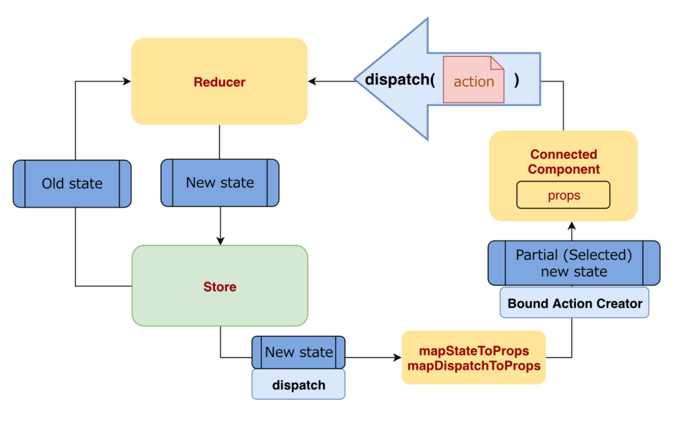
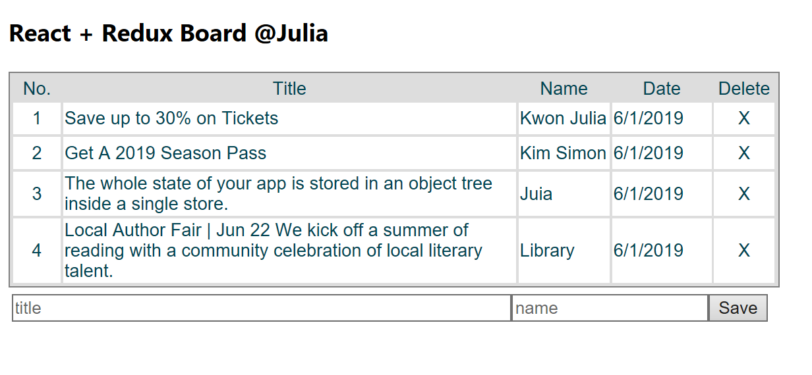

# React_Redux_simpleBoard

CRUD Board with React-Redux 7.0.3

It was updated from React Simple Board https://github.com/JieunKwon/React_create_simpleBoard

> <b> What is Redux? </b>

A predictable state <b>container</b> for JavaScript apps.

> <b> What is React-Redux </b>

React Redux is the official React binding for Redux. 

It lets React components read data from a Redux store, and dispatch actions to the store to update data.

It shows the flow how State changes 

Link to <a href='https://redux.js.org/introduction/getting-started'>Redux https://redux.js.org/introduction/getting-started </a>

> <b> What was updated from the previous version board? </b>

1. Used React-Redux

It allows to use funcion for input and output data between App component(parent) and board items.

To use is, install first

      npm install react-redux
      
2. src/App.js

As the first argument passed in to connect, 

mapStateToProps is used for selecting the part of the data from the store that the connected component needs. 

It’s frequently referred to as just mapState for short.

It is called every time the store state changes.

It receives the entire store state, and should return an object of data this component needs.

       const { boards} = this.props;
       
       ...  
       
       let mapStateToProps = (state) => {

         return {

             boards: state.boards

         };

       }

       export default connect(mapStateToProps)(App);
       
       
  -> ref from Redux <a href="https://react-redux.js.org/using-react-redux/connect-mapstate">https://react-redux.js.org/using-react-redux/connect-mapstate</a>
  
3. src/BoardItem.js 

React Redux provides a connect function to connect other component to the store.

       
       import { connect } from 'react-redux';
       
       ...
       
       export default connect()(BoardItem);
       
       
4. src/App_reducer.js

board_reducer function does every task for board item to save, read, and delete according to type of action.

        
         const BOARD_SAVE = 'SAVE';

         const BOARD_REMOVE = 'REMOVE';

         const BOARD_READ = 'ONE';

         const BOARD_LIST = 'LIST';

         ...

         export default function board_reducer(state = initialState, action) {

                switch(action.type) {

                case BOARD_SAVE:

                ...

                case BOARD_REMOVE:

                ...

                case BOARD_READ:

                ...

                }
        }        
               

> <b> View </b>

